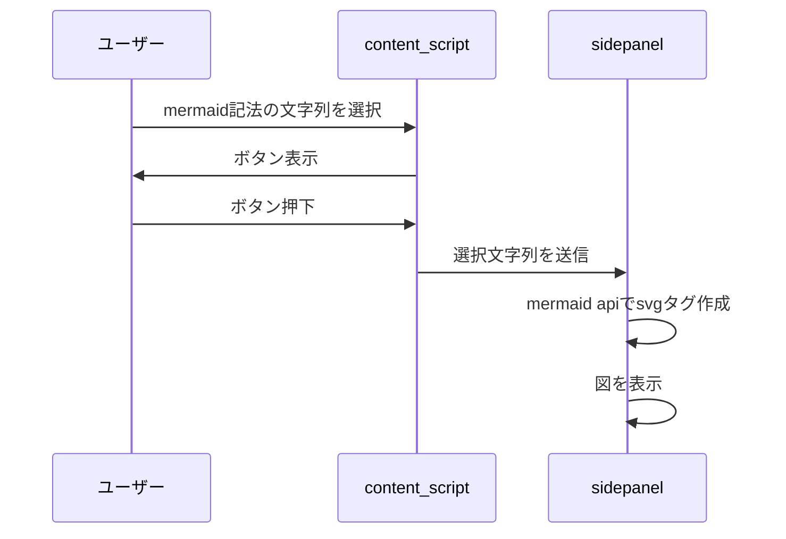

# Meamaid の図を表示させる

## 使用技術

- typescript
- webpack
- sass
- react

## シーケンス図

- content_script
- sidepanel



## 環境構築

1. git clone

```
https://github.com/shokiogawa/mermaid-chrome-extension-react.git
```

2. yarn
3. yarn build
4. dist フォルダに成果物が作成される。
5. chrome 拡張機能管理画面を開き、dist 配下のデータを登録

## 参考

https://mermaid.js.org/config/usage.html
